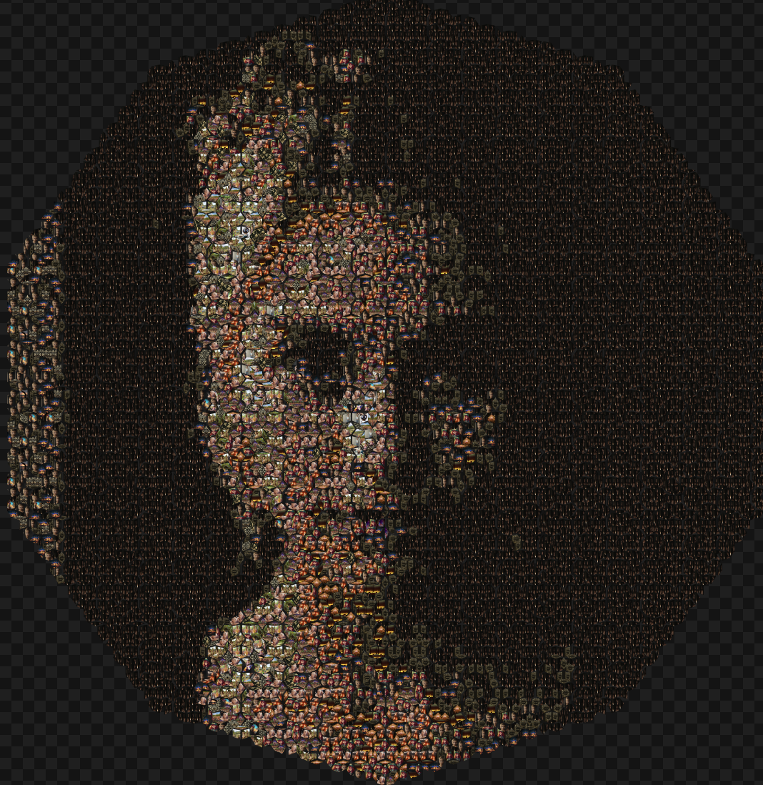
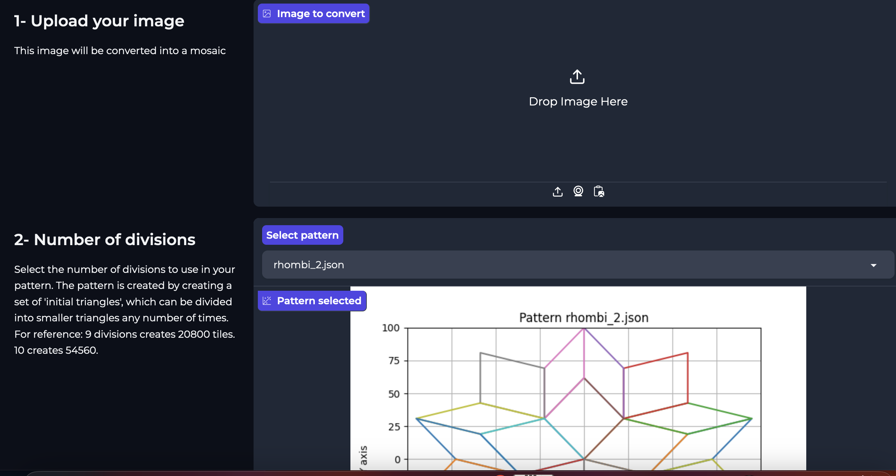
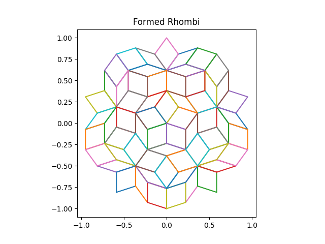
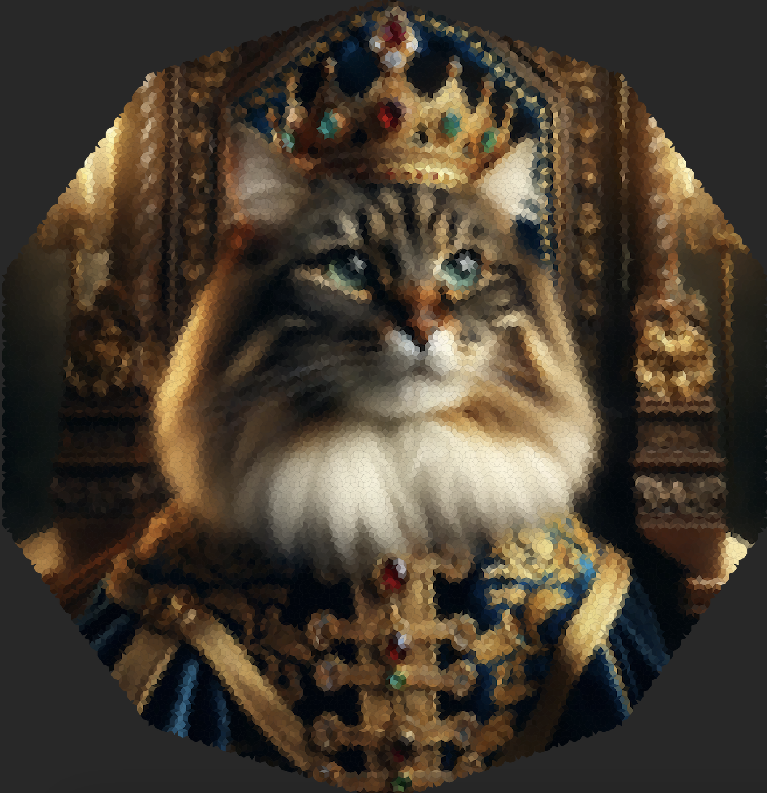
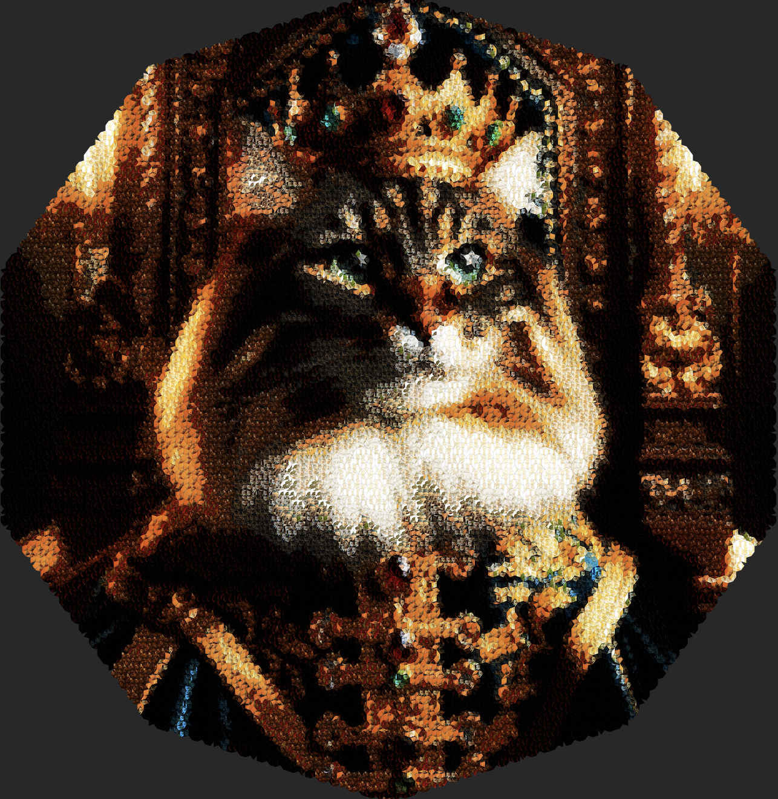
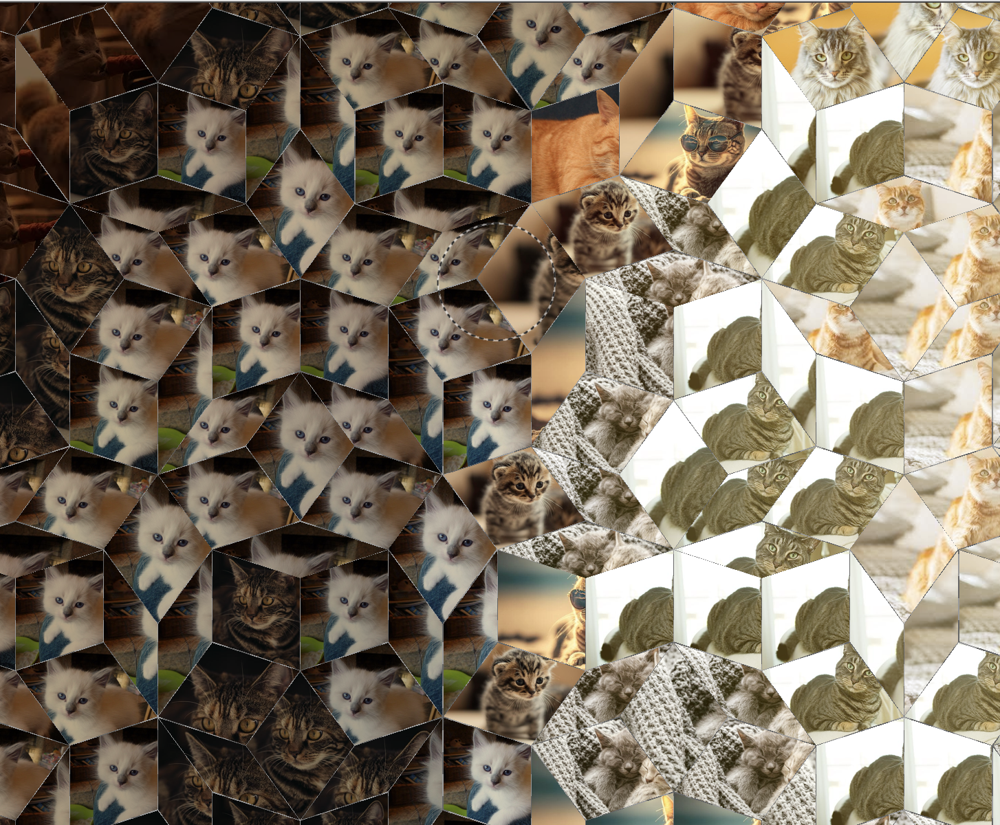

# Penrose Tiles Photomosaic Builder

This project creates a unique photomosaic using Penrose tiling. It takes a target image, an image database, and a specified number of divisions, then assembles a mosaic where each tile is a slice of an image from the database. The matching is based on color proximity, offering a visually appealing and non-repeating pattern of Penrose tiles. It also provides a mosaic of simple colors of your target image. 




## Features

- **Penrose Tiling**: Generates an aesthetically pleasing, non-repeating pattern.
- **Color Matching**: Uses color proximity to select the best matching image from the database for each tile.
- **Color blend**: When replacing a tile, depending on the color difference between the target and the replacement, and the total color variance of the replacement, an overlay blend of the target color is applied to the replacement to smooth it out. 
- **Customizable**: Number of divisions can be adjusted, a higher value creates smaller / more tiles. 
- **Verbose Mode**: Provides detailed process logs.
- **Data visualization**: Provides a graph representation of color spread and distance between the database and the target image. 
- **Solid color mosaic**: Besides generating the photomosaic, it also creates one from solid colors. 

## Requirements

- Python 3.x
- Pillow (PIL Fork)
- Matplotlib
- Numpy

## Setup

1. **Install Dependencies and download package**:
    Clone this repository and make sure you have the required libraries installed. 

    ```
    pip install pillow matplotlib 
    ```

## Usage

To run the photomosaic builder, execute:

```
python main.py
```
and click on the local host link. 



### Alternative Use -> Run the code manually
If you prefer, you can use the functions directly. The start() method can be run by adjusting the following inputs:

1. **Configuration**: Set up your configuration file `config.json` with the following structure:
    
    ```
   { 
    "divisions": 5, 
    "verbose": true, 
    "show_color_analysis": true,
    "source_folder": "path/to/image_source/", 
    "database_path": "path/to/image_database.json", 
    "image_folder": "path/to/image_database/", 
    "image_path": "path/to/target_image.jpg",
    "output_path": "path/to/output/", 
    "mosaic_name": "mosaic_output_name.png", 
    "tile_canvas_name": "tile_canvas_output_name.png", 
    "original_image_name": "original_image_output_name.png", 
    "image_with_borders_name": "image_with_borders_output_name.png"
   }
    ```
    - `divisions`: Number of divisions for Penrose tiling.
    - `verbose`: Enable detailed logging.
    - `show_color_analysis`: Boolean to enable displaying a graph to visualize the colors available in the database and in the target picture. 
    - `source_folder`: Directory where source images for the database are stored.
    - `database_path`: Path to the JSON file where the image database information is saved.
    - `image_folder`: Directory where processed images for the database are stored.
    - `image_path`: Path to the target image for the photomosaic.
    - `output_path`: Directory where output images are saved.
    - `mosaic_name`, `tile_canvas_name`, `original_image_name`, `image_with_borders_name`: Names for various output files.
2. **Image Database**: Populate the `source_folder` with images to be used in the mosaic and place your image on the photomosaic folder, and add replace the file name in config[`image_path`]
 
## Things to keep in mind if you are using the code path / things TODO:
1. Keep your image database in the source_folder -> The process checks each time you run it if its database needs updating, so if you remove images from the source_folder, the process will remove them from the database folder and the database json. 
2. The program will not delete or modify in place your images. That being said, please keep backups of your images before using this. 
3. Although I didn't make it available directly, you can adjust the functions in replace_slices.py to remove color blending. TODO: Make color blending configurable
4. The scaling factor right now attempts to avoid generating massive images. For relatively complex images like faces you probably want 8+ divisions, which is 8000+ tiles. Such an image would be about 15 times as big as your starting image on the current scaling logic (9 divisions = 20.000+ tiles -> 28x scale // 10 -> 60k -> 54x). This is to avoid super massive images, but feel free to adjust the scaling logic as you wish. I didnt find a logic that I felt super confident about. 
5. At the moment, the script requires you have images in your database. There is no check if that's not the case. TODO: Config if you want color mosaic, picture mosaic, or both. At the moment it gives you both. 
6. The script algorithm isn't optimized, and adding divisions increases the amount of tiles by ~2^2,618 per division. 8 and above can be anything from a few minutes to an hour depending on your computer. 

## Examples

### Original target image


### Example penrose Tiling
Here you can see the result after 3 divisions. 


### Solid color mosaic 
9 divisions


### Photomosaic
9 divisions


### Photomosaic + Color blend
Using the color mosaic as a hard light layer on top of the photomosaic


Note: The images are massive, these are simple screenshots. Here's a closeup for reference:



## Number of Rhombi by division chosen
You can think of this as the number of pixels in your new image:

    1 divisions -> 10 rhombi
    2 divisions -> 20 rhombi
    3 divisions -> 60 rhombi
    4 divisions -> 160 rhombi
    5 divisions -> 430 rhombi
    6 divisions -> 1140 rhombi 
    7 divisions -> 3010 rhombi -> ~55 x 55 pixels
    8 divisions -> 7920 rhombi -> ~89 x 89 pixels
    9 divisions -> 20800 rhombi -> ~144 x 144 pixels
    10 divisions -> 54560 rhombi -> ~233 x 233 pixels
    11 divisions -> 143010 rhombi -> ~378 x 378 pixels